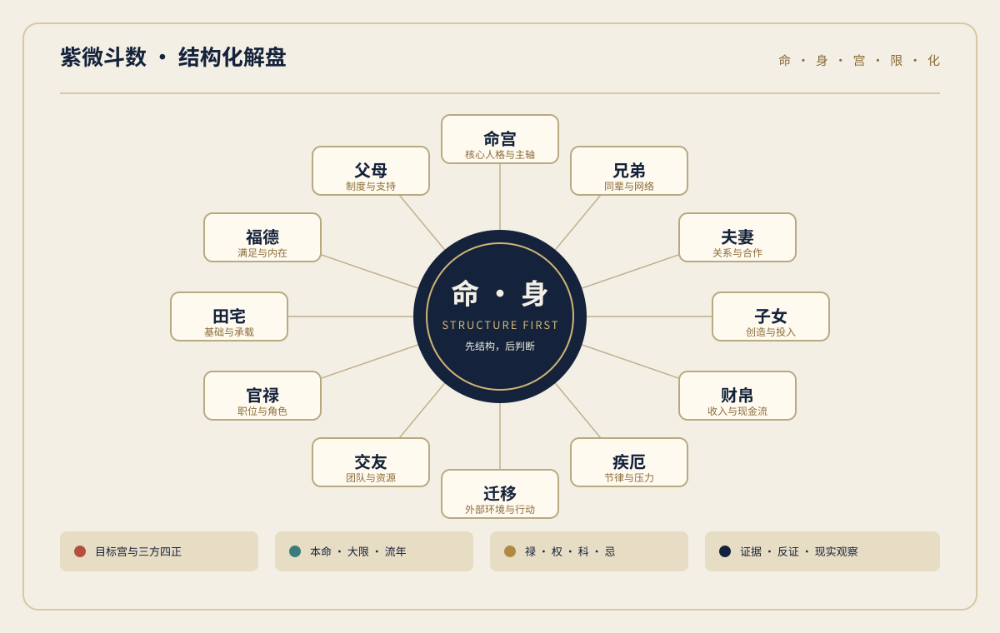

# 紫微斗数 · 结构化解盘 Skill

一个给 Codex 使用的、来源可追溯的紫微斗数分析 Skill。
它把提供的 1994 年《紫微斗数》资料整理成可检索的知识层，再用“宫位结构 → 四化 → 限运 → 反证”的顺序完成现代化解读。



> **定位**：传统文化研究与自我观察工具。输出使用“倾向、窗口、需要留意”等表达，不把命理写成确定预言。

## 适用问题

- 命盘校验：出生资料、命宫、身宫、十二宫、主星和大限。
- 主题解读：事业、财运、感情/婚姻、伴侣、迁移与阶段性时间窗口。
- 结构分析：三方四正、对宫、辅煞、四化和可核验的反向信号。
- 证据化输出：来源章节、盘面证据、置信度、现实观察点和可执行建议。

## 快速使用

在 Codex 中显式调用：

```text
$ziwei-doushu-master
请根据下面的命盘，分析 2026 年农历八月的事业和财运。
```

推荐输入结构化命盘；只有出生资料时，也要说明公历/农历、时辰地支、性别、出生地和真太阳时口径。分析会先校验字段，再按专题路由读取所需参考文件。

## 解读方法

1. **先校验**：确认历法、时辰、命宫、身宫和十二宫是否完整。
2. **再取结构**：目标宫联看命宫、身宫、三方四正、对宫和必要的夹宫。
3. **分开时间层**：本命是长期底色，大限是十年背景，流年/月是触发窗口。
4. **记录四化**：写清来源天干、化星、落宫和作用范围；不把不同门派混成一套。
5. **保留反证**：吉煞并见时分别呈现机会和代价，并降低置信度。
6. **落到现实**：把古籍术语翻译成行为、选择和可观察的现实问题。

## 证据与表达

| 层级 | 优先证据 | 输出要求 |
| --- | --- | --- |
| L1 | 目标宫、命/身宫、三方四正、对宫、主星、四化、限运 | 构成主要结论 |
| L2 | 左右魁钺、昌曲、禄存、天马、羊陀火铃、空耗 | 解释资源与压力 |
| L3 | 单颗弱杂曜、模糊截图、流派争议 | 只能作辅助，不能单独定论 |

结论默认给出 `High / Medium / Low` 置信度。出现同等级反证时，不强行平均吉凶，而是说明两种信号分别会在什么条件下出现。

## 目录

```text
ziwei-doushu-master/
├── SKILL.md                         # 入口规则与安全边界
├── agents/openai.yaml               # Codex 界面元数据
├── knowledge/                       # 原典蒸馏、星曜、宫位、四化与时间规则
├── frameworks/                      # 事业、财富、关系、迁移等专题框架
├── prompts/                         # 主题路由、输入、推理与输出模板
├── schemas/                         # 命盘、证据和分析结果 JSON Schema
├── tests/                           # 评测题与评分规则
└── assets/ziwei-wheel.svg           # GitHub 预览用的结构示意图
```

## 资料来源

主要来源是：宋·希夷先生原著、云居山整理，《紫微斗数》，沈阳出版社，1994 年版。
`knowledge/source-book.md` 提供章节与印刷页码地图；扫描、OCR 或古籍异体字不清之处会标记为 `[UNCERTAIN]`。
本仓库不附带原始 PDF，也不把 README、现代框架或应用默认文案冒充古籍原文。公开发布前请自行确认原始资料的再分发许可。

## 校验

```powershell
python C:\Users\admin\.codex\skills\.system\skill-creator\scripts\quick_validate.py D:\ZiWei\ziwei-doushu-master
```

评测题和评分规则见 `tests/test-cases.md`、`tests/evaluation-rubric.md`。校验器检查 frontmatter、目录命名和未完成脚手架；它不替代对推理质量的人工评审。

## 边界

- 不作医疗诊断、法律判断、投资建议或重大人生决定的替代品。
- 不使用“注定、必然、一定发财、必然分手”等宿命式断言。
- 桃花星只表示吸引力、社交或关系触发，不等同于出轨。
- 没有双方完整资料时，不做合盘结论。
- 流派差异无法消除时，明确写出采用的四化和飞星口径。

## License

当前仓库未附带许可证。公开发布前请先确认 Skill 文档、原典蒸馏内容和第三方素材的权利，再选择合适的许可证；原始 PDF 不在本仓库内。
