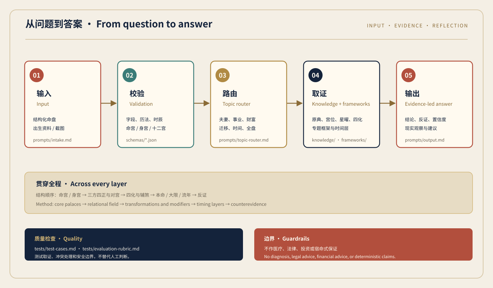

# 紫微斗数 · 结构化解盘

## Zi Wei Dou Shu Master

<p align="center">
  
</p>

一个给 Codex 使用的、来源可追溯的紫微斗数分析 Skill。推算任意一个人生阶段的财运/学业运/事业运/感情运/交友运/健康运/子女运/父母缘分等等。

A source-traceable Zi Wei Dou Shu analysis skill for Codex. It can examine wealth, study, career, relationships, friendships, health-related themes, children, parental ties, and other topics across any stage of life.

> 这是分析工具，不是独立排盘应用，也不把传统术语写成确定预言。
>
> This package provides analysis guidance and references. It is not a standalone chart calculator or a deterministic prediction engine.

## 你可以拿它做什么 · What you can do

| 场景 / Area | 中文示例 / Chinese example | English example | 文件 / Files |
| --- | --- | --- | --- |
| 财运与收入 / Wealth | “当前大限的收入来源和现金流压力是什么？” | “What are the likely income sources and cash-flow pressures in this period?” | [`frameworks/wealth-analysis.md`](frameworks/wealth-analysis.md) |
| 学业与成长 / Study | “这段人生阶段适合怎样安排学习和考试？” | “What study or exam patterns should I observe in this life stage?” | [`frameworks/full-chart-analysis.md`](frameworks/full-chart-analysis.md), [`frameworks/timing-analysis.md`](frameworks/timing-analysis.md) |
| 事业与工作 / Career | “适合创业还是上班？”“哪一段适合换工作？” | “Should I compare employment and entrepreneurship?” | [`frameworks/career-analysis.md`](frameworks/career-analysis.md) |
| 感情与夫妻宫 / Relationships | “详细分析他的夫妻宫”“这段关系的磨合点在哪里？” | “Analyze the spouse palace and the relationship's pressure points.” | [`frameworks/relationship-analysis.md`](frameworks/relationship-analysis.md), [`frameworks/spouse-analysis.md`](frameworks/spouse-analysis.md) |
| 交友与迁移 / Friends & migration | “贵人可能来自什么环境？”“异地发展有哪些机会和成本？” | “Where might useful connections come from, and what are the costs of moving?” | [`frameworks/migration-analysis.md`](frameworks/migration-analysis.md), [`frameworks/full-chart-analysis.md`](frameworks/full-chart-analysis.md) |
| 健康、子女、父母 / Health, children, parents | “需要观察哪些作息和压力信号？”“亲子相处的课题是什么？” | “What routines, stress signals, or family patterns should I observe?” | [`frameworks/full-chart-analysis.md`](frameworks/full-chart-analysis.md), [`prompts/topic-router.md`](prompts/topic-router.md) |

不管问题落在哪个主题，系统都会先检查资料，再选择对应框架。资料不完整时会降低精度，不会补造星曜。

Whatever the topic, the skill validates the input before selecting a framework. When information is missing, it lowers confidence instead of inventing stars.

## 快速开始 · Quick start

### 安装 / Install

把仓库放进 Codex 的 skills 目录，确保 `SKILL.md` 位于目录根部。Windows PowerShell 示例：

Clone the repository into your Codex skills directory, with `SKILL.md` at the package root. Windows PowerShell example:

```powershell
git clone https://github.com/strawberrynine/ZiWeiDouShu-Master.git "$env:USERPROFILE\.codex\skills\ziwei-doushu-master"
```

如果你使用了自定义 `CODEX_HOME` 或其他 skills manager，请把目标目录换成对应位置。

If you use a custom `CODEX_HOME` or another skills manager, replace the target path with its skills directory.

### 调用 / Invoke

在 Codex 对话中显式调用：

```text
$ziwei-doushu-master
请根据下面的结构化命盘，分析 2026 年农历八月的事业和财运。
先列出已确认字段，再给出依据、反证、置信度和现实建议。
```

In English:

```text
$ziwei-doushu-master
Analyze career and wealth for lunar month 8 of 2026 from the chart below.
Validate the fields first, then show evidence, counterevidence, confidence, and practical questions.
```

输入可以是结构化命盘、出生资料或截图。结构化输入最可靠；截图只作三级证据，模糊字段会被列为待确认。时辰字段使用地支索引 `0–11`，不是 0–23 点的小时数。字段约定见 [`schemas/chart-schema.json`](schemas/chart-schema.json)。

You may provide a structured chart, birth details, or an image. Structured data is preferred; an unclear image is treated as level-3 evidence. The `hour` field is an earthly-branch index from `0` to `11`, not a clock hour from `0` to `23`. See [`schemas/chart-schema.json`](schemas/chart-schema.json).

## 使用案例 · Worked examples

### 1. 夫妻宫：先看关系结构 / Spouse palace: read the relationship field

中文调用：

```text
$ziwei-doushu-master
这是完整结构化命盘。请分析他的夫妻宫，范围包括命宫、福德、迁移、官禄、三方四正、对宫、四化和吉煞。
请把“吸引方式、相处压力、需要观察的沟通问题”分开写；不要直接断言结婚、分手或出轨。
```

English prompt:

```text
$ziwei-doushu-master
This is a complete structured chart. Analyze the spouse palace together with the life, fortune, migration, career, tri-harmony, opposite palace, transformations, and auspicious or malefic stars.
Separate attraction, relationship pressure, and communication questions. Do not make guaranteed claims about marriage, separation, or infidelity.
```

示例输出 / Example shape（只展示格式，不代表任何真实命盘结论 / Format only; not a real chart reading）：

```text
已确认 / Confirmed
夫妻宫与命、福德、官禄的字段齐全；采用固定四化表，流派差异另列。
The spouse, life, fortune, and career fields are present; the chosen transformation table is stated.

依据 / Evidence
[SOURCE] 夫妻宫本宫与对宫结构；[DERIVED] 三方四正形成的互动主题。
[SOURCE] Spouse and opposite-palace structure; [DERIVED] interaction inferred from the tri-harmony field.

反证 / Counterevidence
[UNCERTAIN] 福德宫资料不足，长期情绪满足感不能精断。
[UNCERTAIN] The fortune-palace data is incomplete, so long-term emotional satisfaction remains unclear.

置信度 / Confidence
Medium。可观察：冲突时是先解释需求，还是先回避？
Medium. Observe whether conflict leads to a clear request or immediate avoidance.

建议 / Next step
把“想要被理解”改成一条具体请求，观察对方是否能回应。
Turn “I want to be understood” into one specific request and observe the response.
```

### 2. 事业与财运：把象征落到选择 / Career and wealth: connect symbols to choices

中文调用：

```text
$ziwei-doushu-master
请比较这张命盘在当前大限中“稳定工作”和“尝试副业”两条路线。
分别说明收入来源、现金流压力、可验证的现实信号；命理部分不替代投资或职业咨询。
```

English prompt:

```text
$ziwei-doushu-master
Compare stable employment with trying a side project during the current decade cycle.
Describe income sources, cash-flow pressure, and observable signals. Do not treat the reading as financial or career advice.
```

答案会比较命宫、官禄、财帛、迁移和福德，再叠加大限与流年；不会把一颗星直接翻译成唯一职业。

The answer compares the life, career, wealth, migration, and fortune palaces, then adds timing layers. One star is never mapped to one fixed job.

### 3. 模糊截图：先停在能确认的地方 / Blurry screenshot: stop at what can be verified

中文调用：

```text
$ziwei-doushu-master
我只有一张模糊排盘截图。请先列出能读到和读不到的字段，说明哪些结论只能算 Low 置信度，不要补造星曜。
```

English prompt:

```text
$ziwei-doushu-master
I only have a blurry chart screenshot. List readable and unreadable fields first, mark claims that can only be Low confidence, and do not fill in missing stars.
```

日期、时辰地支或宫名看不清时，系统会要求重新导出或补充字段。它不会把 OCR 猜测当成命盘事实。

When dates, hour branches, or palace names cannot be read, the skill asks for a clearer export or the missing fields. OCR guesses are not treated as chart facts.

## 工作流与技术架构 · Workflow and architecture

<p align="center">
  
</p>

| 层 / Layer | 做什么 / Role | 目录 / Files |
| --- | --- | --- |
| 输入与校验 / Input & validation | 识别结构化命盘、出生资料和截图；检查历法、时辰、命宫、身宫与十二宫。<br>Identify chart data, birth details, or images; check calendar, hour, core palaces, and all twelve palaces. | [`prompts/intake.md`](prompts/intake.md), [`schemas/`](schemas/) |
| 主题路由 / Topic routing | 把问题送到夫妻、事业、财富、迁移、时间或全盘框架。<br>Map the question to relationship, career, wealth, migration, timing, or full-chart analysis. | [`prompts/topic-router.md`](prompts/topic-router.md) |
| 知识 / Knowledge | 放置原典页码地图、宫位、星曜、四化、组合、格局和时间规则。<br>Keep source-page maps, palace and star notes, transformations, formations, combinations, and timing rules. | [`knowledge/`](knowledge/) |
| 专题推理 / Frameworks | 将同一套证据顺序应用到关系、事业、财富等问题。<br>Apply the same evidence order to relationship, career, wealth, and other topics. | [`frameworks/`](frameworks/) |
| 输出 / Output | 给出结论、依据、反证、置信度、时间范围和现实观察点。<br>Return claims, evidence, counterevidence, confidence, timing scope, and practical observations. | [`prompts/output.md`](prompts/output.md), [`schemas/analysis-schema.json`](schemas/analysis-schema.json) |
| 质量与边界 / Quality & guardrails | 用测试题检查取证和安全表达；不把象征写成医疗、法律、投资或宿命保证。<br>Use tests for evidence and safe wording; do not turn symbols into medical, legal, financial, or deterministic claims. | [`tests/`](tests/), [`SKILL.md`](SKILL.md) |

流程写在文件里：先校验资料，再读宫位关系，分开本命和限运，最后同时写出支持与压力。

The workflow is explicit in the files: validate the data, read palace relationships, separate natal and timing layers, then state both support and friction.

## 证据怎么进入答案 · How evidence is used

分析时按这个顺序读取：

1. 命宫、身宫、目标宫、三方四正、对宫和限运。<br>Start with the life, body, target, tri-harmony, opposite, and timing palaces.
2. 主星、亮度、四化，以及辅弼魁钺、昌曲、禄存、天马、羊陀火铃、空耗等会照。<br>Add major stars, brightness, transformations, and supporting or malefic modifiers.
3. 原典引用、流派差异、反向信号和资料缺口。<br>State source citations, school differences, counter-signals, and missing data.

| 标签 / Label | 含义 / Meaning |
| --- | --- |
| `[SOURCE]` | 1994 年版《紫微斗数》及其页码/章节能直接支持的规则。<br>A rule directly supported by the 1994 edition and its cited page or chapter. |
| `[FRAMEWORK]` | 本仓库的分析流程，不冒充古籍原文。<br>A workflow defined by this repository, not a quotation from the classic. |
| `[DERIVED]` | 将多条规则组合后得到的中间判断。<br>An intermediate result combined from multiple rules. |
| `[INTERPRETATION]` | 把古典术语翻成现代、可讨论的语言。<br>A modern, discussable rendering of classical terms. |
| `[INFERENCE]` | 结合当前命盘得出的推断，必须说明证据。<br>An inference from the supplied chart, with its evidence shown. |
| `[UNCERTAIN]` | 字段不完整、截图不清或流派存在差异。<br>Incomplete fields, unclear images, or school differences. |

三个相互独立的一级结构都支持同一结论时，通常可写 `High`；有重要反证时降为 `Medium`；只靠单星或单宫时保持 `Low`。正反信号同时出现，就分别说明它们在什么条件下会出现。

Three independent level-1 structures can support `High`; important counterevidence lowers it to `Medium`; a claim based on one star or one palace stays `Low`. When signals conflict, the answer explains the conditions behind each one.

## 数据契约 · Data contract

### 输入命盘 / Chart input

[`schemas/chart-schema.json`](schemas/chart-schema.json) 要求 / requires:

| 字段 / Field | 说明 / Description |
| --- | --- |
| `birthInfo` | 年、月、日、时辰地支索引和性别；地点/经度可选。<br>Year, month, day, earthly-branch hour index, and gender; location and longitude are optional. |
| `mingGongBranch` / `shenGongBranch` | 命宫、身宫所在地支索引。<br>Earthly-branch indexes for the life and body palaces. |
| `palaces` | 12 个宫位；每个宫位至少有 `branch`、`stem`、`name`、`stars`。<br>Twelve palaces; each has at least `branch`, `stem`, `name`, and `stars`. |
| `daXians` | 大限数组；时间问题需要同时说明年龄口径。<br>Decade-cycle data; timing questions must state the age convention. |

### 输出分析 / Analysis output

[`schemas/analysis-schema.json`](schemas/analysis-schema.json) 固定 `method`、`question`、`summary`、`claims`、`limitations` 和 `advice`；每条 claim 可附 [`schemas/evidence-schema.json`](schemas/evidence-schema.json) 中的证据、反证、来源标签和时间层。

The output schema requires `method`, `question`, `summary`, `claims`, `limitations`, and `advice`. Each claim can carry evidence, counterevidence, source labels, and a timing layer from [`schemas/evidence-schema.json`](schemas/evidence-schema.json).

## 目录 · Repository map

```text
ziwei-doushu-master/
├── SKILL.md                         # 入口规则 / skill instructions
├── agents/openai.yaml               # Codex 界面元数据 / UI metadata
├── prompts/                         # 输入、路由、推理、输出 / routing and output
├── frameworks/                      # 主题分析框架 / topic frameworks
├── knowledge/                       # 原典与结构规则 / source and domain notes
├── schemas/                         # 输入、证据、输出契约 / JSON contracts
├── tests/                           # 测试题与评分规则 / evaluation suite
└── assets/                          # GitHub 预览图 / visual references
```

如果你要改分析口径，先看 [`SKILL.md`](SKILL.md) 和对应专题文件；如果要改输入或输出格式，先改 schema，再同步提示词和测试。

For a rule change, start with `SKILL.md` and the relevant framework. For a contract change, update the schema first, then check prompts and tests.

## 资料、版权与许可 · Sources, attribution, and license

主要资料是宋·希夷先生原著、云居山整理，《紫微斗数》，沈阳出版社，1994 年版。章节与印刷页码见 [`knowledge/source-book.md`](knowledge/source-book.md)；扫描或 OCR 不清的地方标为 `[UNCERTAIN]`。原始 PDF 不在本仓库内，README 和现代框架也不冒充古籍原文。

The repository also contains modern analysis frameworks and distilled notes. Keep their labels separate from quotations. Before redistributing the package or adding third-party material, check the source's terms and preserve attribution.

当前仓库没有附带许可证。公开发布前，请先确认 Skill 文档、原典蒸馏内容和第三方素材的权利，再选择许可证。

This repository currently ships without a license. Confirm the rights of the skill text, distilled source material, and any third-party assets before choosing one.

## 边界 · Boundaries

- 紫微斗数在这里是传统文化与自我观察的框架，不是事实预测器。<br>Zi Wei Dou Shu is used here as a traditional and reflective framework, not a fact predictor.
- 不提供医疗诊断、法律判断、投资建议或重大人生决定的替代方案。<br>It does not replace medical diagnosis, legal judgment, financial advice, or major life decisions.
- 不写“注定、必然、一定发财、必然分手”等确定断言。<br>It avoids deterministic claims such as “destined,” “guaranteed wealth,” or “certain separation.”
- 桃花星只表示吸引力、社交或关系触发，不能直接等同出轨。<br>Romance stars indicate attraction, social contact, or relationship triggers; they do not prove infidelity.
- 没有双方完整资料时，不做合盘结论。<br>Do not make a compatibility reading without complete data for both people.

这个 Skill 会把不确定性写出来，把决定权留给使用者。涉及健康、法律、财务和关系的现实决定，仍应由当事人和合适的专业人士共同判断。

The skill keeps uncertainty visible and leaves decisions with the user. Real-world health, legal, financial, and relationship decisions belong to the people involved and qualified professionals.

## 校验 · Validation

在仓库根目录运行 / From the repository root:

```powershell
python <CODEX_HOME>\skills\.system\skill-creator\scripts\quick_validate.py .
git diff --check
```

如果未设置 `CODEX_HOME`，把路径替换为本机 `.codex\skills\.system\skill-creator\scripts\quick_validate.py` 的实际位置。测试场景见 [`tests/test-cases.md`](tests/test-cases.md)，评分规则见 [`tests/evaluation-rubric.md`](tests/evaluation-rubric.md)。

If `CODEX_HOME` is not set, replace the path with the actual `.codex\skills\.system\skill-creator\scripts\quick_validate.py` location. See [`tests/test-cases.md`](tests/test-cases.md) for scenarios and [`tests/evaluation-rubric.md`](tests/evaluation-rubric.md) for the scoring rubric.

校验器检查包结构，不判断解读是否正确；官方校验需要本机安装 `PyYAML`。

The validator checks package structure, not the quality of a reading; it requires `PyYAML` to be installed locally.
